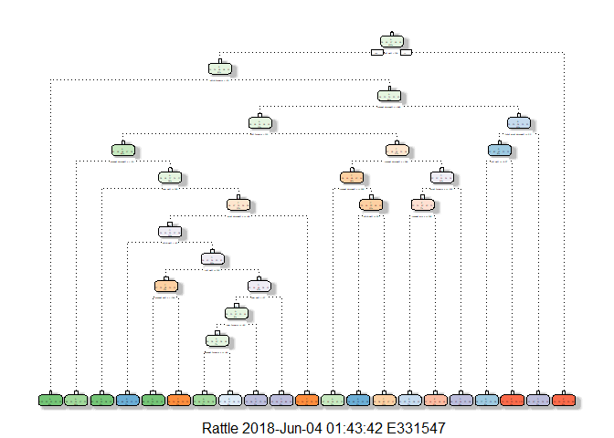
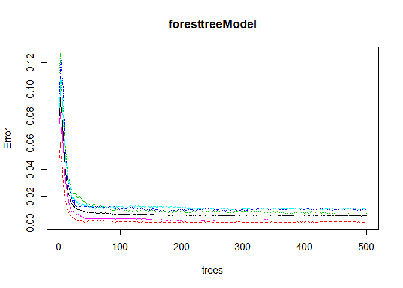
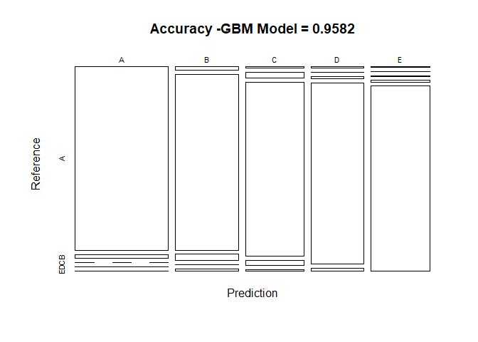

# Background

Using devices such as Jawbone Up, Nike FuelBand, and Fitbit it is now possible to collect a large amount of data about personal activity relatively inexpensively. These type of devices are part of the quantified self movement - a group of enthusiasts who take measurements about themselves regularly to improve their health, to find patterns in their behavior, or because they are tech geeks. One thing that people regularly do is quantify how much of a particular activity they do, but they rarely quantify how well they do it. In this project, the goal will be to use data from accelerometers on the belt, forearm, arm, and dumbell of 6 participants. They were asked to perform barbell lifts correctly and incorrectly in 5 different ways. More information is available from the website here: http://web.archive.org/web/20161224072740/http:/groupware.les.inf.puc-rio.br/har (see the section on the Weight Lifting Exercise Dataset).

# Loading Data and performing exploratory analysis

## Data 

### The training data for this project are available here:

https://d396qusza40orc.cloudfront.net/predmachlearn/pml-training.csv

### The test data are available here:

https://d396qusza40orc.cloudfront.net/predmachlearn/pml-testing.csv


```r
#Load the libraries

library(knitr)
library(caret)
```

```
## Loading required package: lattice
```

```
## Loading required package: ggplot2
```

```r
library(rpart)
library(rpart.plot)
library(RColorBrewer)
library(rattle)
```

```
## Rattle: A free graphical interface for data science with R.
## Version 5.1.0 Copyright (c) 2006-2017 Togaware Pty Ltd.
## Type 'rattle()' to shake, rattle, and roll your data.
```

```r
library(randomForest)
```

```
## randomForest 4.6-14
```

```
## Type rfNews() to see new features/changes/bug fixes.
```

```
## 
## Attaching package: 'randomForest'
```

```
## The following object is masked from 'package:rattle':
## 
##     importance
```

```
## The following object is masked from 'package:ggplot2':
## 
##     margin
```

```r
library(gbm)
```

```
## Loading required package: survival
```

```
## 
## Attaching package: 'survival'
```

```
## The following object is masked from 'package:caret':
## 
##     cluster
```

```
## Loading required package: splines
```

```
## Loading required package: parallel
```

```
## Loaded gbm 2.1.3
```

```r
library(plyr)

trainingdatafile <- "C:\\santhanam\\DatascienceToolkit\\sanrepository\\MachinelearningProject\\pml-training.csv"
 
 if (!file.exists(trainingdatafile))
{
  trainingdataurl <- "https://d396qusza40orc.cloudfront.net/predmachlearn/pml-training.csv"
  download.file(url = trainingdataurl, destfile = trainingdatafile)
}


## load the training data
trainingdataset <- read.csv(trainingdatafile,na.strings=c("NA","#DIV/0!",""))

##download test data

testdatafile <- "C:\\santhanam\\DatascienceToolkit\\sanrepository\\MachinelearningProject\\pml-testing.csv"
 
 if (!file.exists(testdatafile))
{
  testingdataurl <- "https://d396qusza40orc.cloudfront.net/predmachlearn/pml-testing.csv"
  download.file(url = testingdataurl, destfile = testdatafile)
}

## load the testing data set
testingdataset <- read.csv(testdatafile,na.strings=c("NA","#DIV/0!",""))

##Data clean up

### Remove all columns that contain NA, remove Attributes that are not in the testing dataset.
### Also remove frst 7 Attributes that are not numeric

attributesdata <- names(testingdataset[,colSums(is.na(testingdataset)) == 0])[8:59]

# Only use attributes used in testing cases.
trainingdataset <- trainingdataset[,c(attributesdata,"classe")]
testingdataset <- testingdataset[,c(attributesdata,"problem_id")]


dim(trainingdataset); 
```

```
## [1] 19622    53
```

```r
dim(testingdataset);
```

```
## [1] 20 53
```

```r
## After cleaning, we can see that the number of vairables for the analysis are now only 53


## Perform Dataset partition


datapartitionTrain <- createDataPartition(trainingdataset$classe, p=0.7, list=FALSE)
trainingdataPartioned <- trainingdataset[datapartitionTrain,]
testingdatapartioned <- trainingdataset[-datapartitionTrain,]

dim(trainingdataPartioned); dim(testingdatapartioned);
```

```
## [1] 13737    53
```

```
## [1] 5885   53
```

```r
#Perform Prediction Modeling Using Decision Tree Model


##The expectation of accuracy is not high,expectation is around 70 to 80%
set.seed(501)
decisiontreemodelData <- rpart(classe ~ ., data = trainingdataPartioned, method="class", control = rpart.control(method = "cv", number = 5))
fancyRpartPlot(decisiontreemodelData)
```

<!-- -->

```r
#Predict with Decision Tree Model
set.seed(501)

dtPrediction <- predict(decisiontreemodelData, testingdatapartioned, type = "class")
confusionMatrix(dtPrediction, testingdatapartioned$classe)
```

```
## Confusion Matrix and Statistics
## 
##           Reference
## Prediction    A    B    C    D    E
##          A 1496  248   26   90   63
##          B   41  664  138   52  125
##          C   38   94  776  147  104
##          D   72   99   60  642   93
##          E   27   34   26   33  697
## 
## Overall Statistics
##                                           
##                Accuracy : 0.7264          
##                  95% CI : (0.7148, 0.7378)
##     No Information Rate : 0.2845          
##     P-Value [Acc > NIR] : < 2.2e-16       
##                                           
##                   Kappa : 0.6523          
##  Mcnemar's Test P-Value : < 2.2e-16       
## 
## Statistics by Class:
## 
##                      Class: A Class: B Class: C Class: D Class: E
## Sensitivity            0.8937   0.5830   0.7563   0.6660   0.6442
## Specificity            0.8986   0.9250   0.9212   0.9342   0.9750
## Pos Pred Value         0.7780   0.6510   0.6695   0.6646   0.8531
## Neg Pred Value         0.9551   0.9024   0.9471   0.9345   0.9240
## Prevalence             0.2845   0.1935   0.1743   0.1638   0.1839
## Detection Rate         0.2542   0.1128   0.1319   0.1091   0.1184
## Detection Prevalence   0.3268   0.1733   0.1969   0.1641   0.1388
## Balanced Accuracy      0.8961   0.7540   0.8388   0.8001   0.8096
```

```r
#Building Random Forest Model, the expectation is that the accuracy will be very high close to 99%

set.seed(501)
foresttreeModel <- randomForest(classe ~ ., data = trainingdataPartioned, method = "rf", importance = T, trControl = trainControl(method = "cv", classProbs=TRUE,savePredictions=TRUE,allowParallel=TRUE, number = 5))

plot(foresttreeModel)
```

<!-- -->

```r
#Predicting with Forest Tree model

forestreeprediction <- predict(foresttreeModel, testingdatapartioned, type = "class")
confusionMatrix(forestreeprediction, testingdatapartioned$classe)
```

```
## Confusion Matrix and Statistics
## 
##           Reference
## Prediction    A    B    C    D    E
##          A 1674    5    0    0    0
##          B    0 1133    8    0    0
##          C    0    1 1017   12    2
##          D    0    0    1  951    6
##          E    0    0    0    1 1074
## 
## Overall Statistics
##                                           
##                Accuracy : 0.9939          
##                  95% CI : (0.9915, 0.9957)
##     No Information Rate : 0.2845          
##     P-Value [Acc > NIR] : < 2.2e-16       
##                                           
##                   Kappa : 0.9923          
##  Mcnemar's Test P-Value : NA              
## 
## Statistics by Class:
## 
##                      Class: A Class: B Class: C Class: D Class: E
## Sensitivity            1.0000   0.9947   0.9912   0.9865   0.9926
## Specificity            0.9988   0.9983   0.9969   0.9986   0.9998
## Pos Pred Value         0.9970   0.9930   0.9855   0.9927   0.9991
## Neg Pred Value         1.0000   0.9987   0.9981   0.9974   0.9983
## Prevalence             0.2845   0.1935   0.1743   0.1638   0.1839
## Detection Rate         0.2845   0.1925   0.1728   0.1616   0.1825
## Detection Prevalence   0.2853   0.1939   0.1754   0.1628   0.1827
## Balanced Accuracy      0.9994   0.9965   0.9941   0.9925   0.9962
```

```r
### As the results indicate forest tree model had an accuracy of 99.5% with sample test date

#Building Generalized Boosted Model(GBM)

set.seed(123)
trcontrolgbm <- trainControl(method = "repeatedcv", number = 5, repeats = 1)
gbmModel  <- train(classe ~ ., data=trainingdataPartioned, method = "gbm",
                    trControl = trcontrolgbm, verbose = F)
gbmModel
```

```
## Stochastic Gradient Boosting 
## 
## 13737 samples
##    52 predictor
##     5 classes: 'A', 'B', 'C', 'D', 'E' 
## 
## No pre-processing
## Resampling: Cross-Validated (5 fold, repeated 1 times) 
## Summary of sample sizes: 10989, 10989, 10991, 10988, 10991 
## Resampling results across tuning parameters:
## 
##   interaction.depth  n.trees  Accuracy   Kappa    
##   1                   50      0.7524200  0.6861432
##   1                  100      0.8196834  0.7716368
##   1                  150      0.8555729  0.8172173
##   2                   50      0.8561545  0.8177433
##   2                  100      0.9079128  0.8834556
##   2                  150      0.9321533  0.9141475
##   3                   50      0.8972848  0.8699810
##   3                  100      0.9429277  0.9277955
##   3                  150      0.9617093  0.9515624
## 
## Tuning parameter 'shrinkage' was held constant at a value of 0.1
## 
## Tuning parameter 'n.minobsinnode' was held constant at a value of 10
## Accuracy was used to select the optimal model using the largest value.
## The final values used for the model were n.trees = 150,
##  interaction.depth = 3, shrinkage = 0.1 and n.minobsinnode = 10.
```

```r
#Prediction based on GBM on the partion test data set


predictwithgbm<- predict(gbmModel,testingdatapartioned)
confgbmmatrix <- confusionMatrix(predictwithgbm, testingdatapartioned$classe)

plot(confgbmmatrix$table, col = confgbmmatrix$byClass, 
     main = paste("Accuracy -GBM Model =", round(confgbmmatrix$overall['Accuracy'], 4)))
```

<!-- -->

```r
#The Forest Model prediction on the sample data set showed highest accouracy.
##Applying that model to answer the quiz questions by applying it on the full testdata set

foresttreepredictionfinal <- predict(foresttreeModel, testingdataset)
foresttreepredictionfinal
```

```
##  1  2  3  4  5  6  7  8  9 10 11 12 13 14 15 16 17 18 19 20 
##  B  A  B  A  A  E  D  B  A  A  B  C  B  A  E  E  A  B  B  B 
## Levels: A B C D E
```
